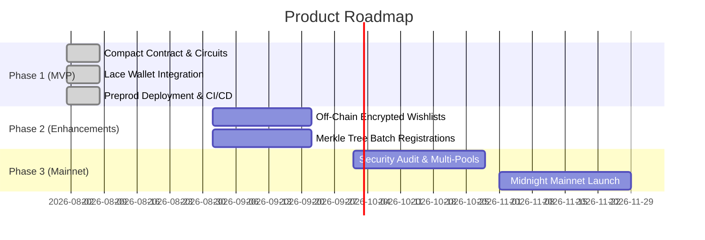

# Product Proposal: Private Secret Santa on Midnight

## 1. Executive Summary & Problem Statement
Organizing gift exchanges (Secret Santa) within companies, communities, and families has historically suffered from a fundamental privacy flaw: **the organizer always knows the pairings**, or a centralized third-party server holds the full plaintext mapping of who is giving gifts to whom.

Existing Web2 solutions (DrawNames, Elfster, SecretSanta.com) require trusting a centralized database with personal emails, wishlists, and pairing data. Conversely, transparent Web3 blockchains (Ethereum, Solana) cannot handle private assignments because all smart contract storage and transactions are publicly visible in the global ledger state.

**Private Secret Santa** solves this by leveraging **Midnight Network's zero-knowledge programmable privacy**, enabling trustless, decentralized participant registration and mathematical proof of valid gift assignment without disclosing pairings to the public, the contract, or even the organizer.

---

## 2. Target Audience & User Personas

| Persona | Description | Core Pain Point Solved |
|---|---|---|
| **Remote Web3 Teams & DAOs** | Distributed teams organizing holiday gift exchanges and bounties. | Eliminates the need for a central organizer to possess the master pairing list. |
| **Privacy-Conscious Communities** | Communities wanting verifiable on-chain events without exposing social graphs. | Ensures participant associations and relationships are never leaked to chain analytics. |
| **Web3 Social DApps** | Platforms requiring private random matching (e.g., blind matchmaking, anonymous gifting). | Reusable zero-knowledge pairing verification primitive. |

---

## 3. Why Midnight Specifically?
Midnight is uniquely positioned to power Private Secret Santa due to its dual-ledger architecture:

1. **Native Compact Language:** Compact makes privacy-preserving programming intuitive. Circuits cleanly demarcate public ledger state from private witness variables using the explicit `disclose()` primitive.
2. **Client-Side Proving via WASM / Lace:** Proofs are constructed locally in the user's browser or wallet environment. Sensitive inputs (such as the recipient's identity) never leave the user's machine in plaintext.
3. **Deterministic Verification:** The Midnight consensus layer validates the succinct ZK proof against the circuit's verification key in milliseconds with minimal gas overhead.

---

## 4. Comprehensive Data Model

| Data Attribute | Storage Location | Privacy Classification | Visibility | Purpose |
|---|---|---|---|---|
| `address` | On-Chain Ledger (`participants`) | Public (`disclose`) | Global / All Observers | Verifies registration and eligibility. |
| `assignment_status` | On-Chain Ledger (`received_assignment`) | Public (`disclose`) | Global / All Observers | Confirms participant has received valid assignment. |
| `assigned_to` | Client Prover Memory | **Private Witness** | **Nobody (Private to Caller)** | Input to ZK circuit to verify valid recipient without leaking identity. |

---

## 5. Security & Threat Model

- **Observer Eavesdropping:** An observer monitoring the Midnight indexer or RPC node sees registration events and proof verification transactions. Because `assigned_to` is never disclosed, the observer gains zero knowledge regarding the recipient graph.
- **Sybil Resistance:** Each registration requires an unshielded key signature and standard DUST transaction fees, preventing spam registrations.
- **Malicious Claim Prevention:** The `receive_assignment` circuit asserts `participants.member(disclose(address))`, ensuring only registered participants can submit assignment verification proofs.

---

## 6. Mainnet Feasibility & Commercial Viability

- **Low Computational Complexity:** The Compact circuits are compact and efficient (`k=9, 303 rows` for registration; `k=10, 583 rows` for assignment verification). Proof generation executes in under 2 seconds on standard client devices.
- **Predictable Gas Model:** Transaction verification utilizes minimal execution steps on the Midnight consensus engine.
- **Scalability:** The architecture scales linearly with the number of participants. Future iterations can utilize Merkle accumulator trees to support thousands of concurrent participants in a single pool.

---

## 7. Product Roadmap

