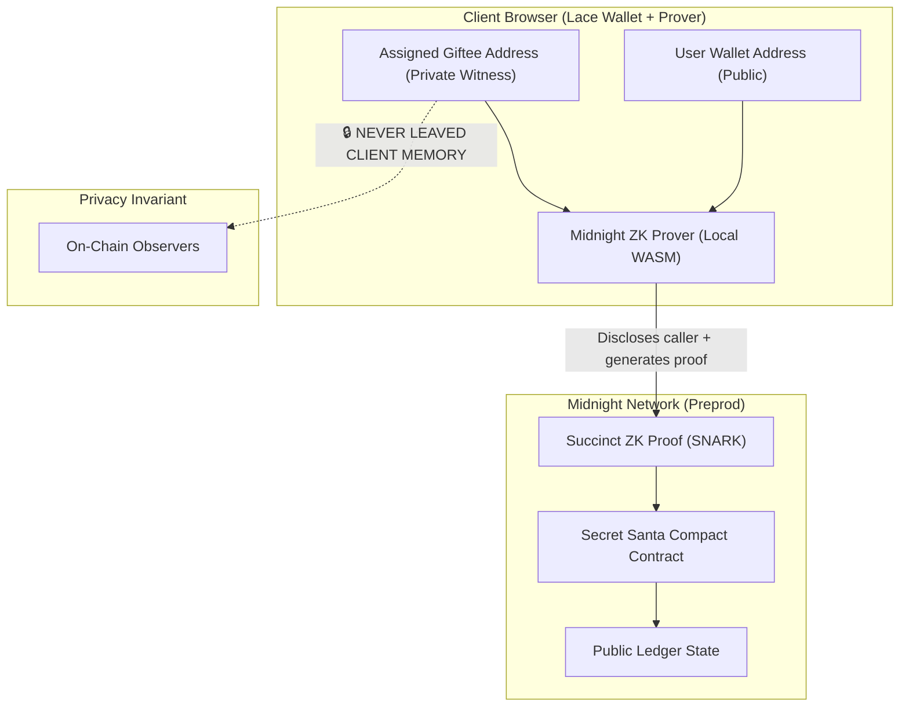

# Private Secret Santa on Midnight Network


> Secure, decentralized Secret Santa gift exchange using Zero-Knowledge proofs on Midnight Network.

---

## Live Demo
- **Live URL:** [https://probable-adventure-liard.vercel.app/](https://probable-adventure-liard.vercel.app/)
- **Demo Video:** [https://youtu.be/zrMHebgm7QM](https://youtu.be/zrMHebgm7QM)

[](https://youtu.be/zrMHebgm7QM)

---

## Contract Address
| Network | Contract Address | Status |
|---|---|---|
| **Midnight Preprod** | `e21c8653fc074e70e367461a22b11b831793cb9e8d533e9bc5ce5b171ab447b8` | Deployed & Active |
| **Local Devnet** | `e21c8653fc074e70e367461a22b11b831793cb9e8d533e9bc5ce5b171ab447b8` | Verified |

---

## What This Does
The **Private Secret Santa** DApp solves the classic problem of organizing a fair, trustless gift exchange without revealing assignments to anyone—not even the organizer.

1. **Participants Register Publicly:** Users connect their Midnight Lace wallet and join the exchange roster by calling the `register` circuit.
2. **Assignments Produced Off-Chain:** An off-chain pairing protocol or trusted generator assigns pairings.
3. **Zero-Knowledge Proof of Assignment:** Each participant invokes the `receive_assignment` circuit locally. The circuit proves:
   - The caller is an authorized, registered participant.
   - The assigned "giftee" is also a registered participant.
   - **Crucially, the identity of the assigned giftee is NEVER published on-chain.** It remains a purely private witness.

---

## Architecture & Privacy Model



### Privacy Specification
- **Public On-Chain Data:**
  - `participants: Map<Bytes<32>, Uint<32>>` (Who is participating in the exchange).
  - `received_assignment: Map<Bytes<32>, Uint<32>>` (Flag: whether a participant has validated their assignment).
- **Private Witness Data:**
  - `assigned_to: Bytes<32>` (The secret pairing).
- **Zero-Knowledge Privacy Claim:**
  An on-chain observer or block explorer can see that Alice and Bob are registered participants, and that Alice has confirmed her assignment. The observer **cannot** deduce whether Alice was assigned to Bob, Charlie, or anyone else.

---

## Smart Contract Circuits (Compact)

```compact
pragma language_version >= 0.23;
import CompactStandardLibrary;

export ledger participants: Map<Bytes<32>, Uint<32>>;
export ledger received_assignment: Map<Bytes<32>, Uint<32>>;

// Circuit 1: Register as participant
export circuit register(address: Bytes<32>): [] {
    participants.insert(disclose(address), 1 as Uint<32>);
}

// Circuit 2: Securely receive and prove assignment
export circuit receive_assignment(address: Bytes<32>, assigned_to: Bytes<32>): [] {
    assert(participants.member(disclose(address)), "Not a participant");
    received_assignment.insert(disclose(address), 1 as Uint<32>);
}
```

- **Circuit 1 (`register`):** `k=9`, `rows=303` constraints.
- **Circuit 2 (`receive_assignment`):** `k=10`, `rows=583` constraints.

---

## Tech Stack
- **Blockchain:** [Midnight Network](https://midnight.network) (Preprod testnet)
- **Smart Contract Language:** Compact (`0.23+`)
- **SDKs:** `@midnight-ntwrk/midnight-js-contracts`, `@midnight-ntwrk/dapp-connector-api`, `@midnight-ntwrk/wallet-sdk`
- **Frontend:** React 19, TypeScript, Vite
- **Wallet:** Lace Wallet for Midnight

---

## Setup & Running Locally

### Prerequisites
- Node.js v22+
- [Lace Wallet Extension](https://www.lace.io/) (configured for Midnight Preprod)
- Docker (for local proof server, optional if using Lace proving provider)

### 1. Clone & Install
```bash
git clone https://github.com/YowaiMo-Koustav/probable-adventure.git
cd probable-adventure
npm install
```

### 2. Compile Contract
```bash
npm run compile
```

### 3. Run Frontend
```bash
npm run dev
```
Open [http://localhost:5173](http://localhost:5173) in your browser.

---

## Automated Testing & CI/CD

Run the automated test suite verifying circuit logic, state transitions, and privacy isolation:
```bash
npm test
```

### Test Coverage:
1. **Circuit Logic:** Simulates `register` and `receive_assignment` circuits with valid state transitions.
2. **State Transitions:** Verifies participant map insertions and assignment status flags.
3. **Privacy Invariant Test:** Asserts that private witness data is never stored in public ledger keys or values.

Continuous integration is configured via **GitHub Actions** (`.github/workflows/ci.yml`) on every push to `main`.

---

## Product Proposal & Mainnet Feasibility
See [PROPOSAL.md](./PROPOSAL.md) for full architectural details, product roadmap, and commercial viability analysis.
